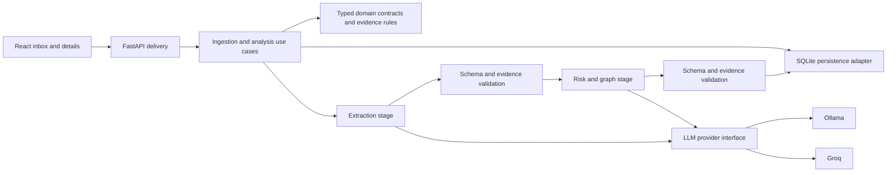

# Mail Risk Intelligence

A local full-stack email triage tool for the fictional Arcline compliance team. It extracts facts, assesses risk through two chained LLM stages, and persists evidence-linked entities and relationships.

## Status

The mandatory application flow is implemented: ten seed emails, pasted text and file ingestion, responsive inbox/detail views, extraction/risk panels, entities/relationships, provider adapters, SQLite history, retries, and tests. The bonus aggregate Canvas 2D knowledge graph is also implemented. A [committed SQLite demo snapshot](backend/fixtures/README.md) supplies real GPT-OSS results on first startup, with no startup inference.

**No evaluated configuration is approved for unattended triage.** The latest [fifteen-case comparison](evaluations/EXPANDED_COMPARISON_2026-10-06.md) completed 13/15 with Groq GPT-OSS 120B, 13/15 with local Qwen 3.5 4B, and 6/15 with local Llama 3.2 3B. Groq is the recommended supervised-demo configuration based on latency and qualitative review; Ollama remains the no-key default. Semantic gaps remain in every candidate and independent human review is pending. Provider failures remain visible and are never treated as risk `none`. Earlier [Llama](evaluations/LLAMA_BASELINE_2026-10-06.md) and [Groq](evaluations/GROQ_BASELINE_2026-10-06.md) baselines retain their historical settings/results.

A [prompt-only v2 experiment](evaluations/PROMPT_EXPERIMENT_V2_2026-10-06.md) regressed completion from 5/10 to 2/10. Its prompts are archived for reproduction; default prompts remain the baseline version.

## Quick start

For installation, provider/key selection, every terminal command, troubleshooting and shutdown, follow the [complete run guide](docs/RUNNING.md). **Viewing precomputed results requires neither Ollama nor an API key** with the default provider configuration. Local Ollama inference requires no API key. Groq requires a private Groq key for new analyses and does not require an Ollama installation.

Requirements: Python 3.11+, [uv](https://docs.astral.sh/uv/), Node.js 22.12+ and npm. Dependencies are locked in `backend/uv.lock` and `frontend/package-lock.json`.

Start the backend in one terminal, from the repository root:

```sh
cd backend
uv sync --locked
test -f .env || cp .env.example .env
uv run uvicorn mailrisk.api:app --host 127.0.0.1 --port 8000
```

Start the UI in a second terminal:

```sh
cd frontend
npm ci
npm run dev
```

Open the URL printed by Vite (normally `http://127.0.0.1:5173`). The Vite development proxy forwards `/api` to backend port 8000. FastAPI API documentation is at `http://127.0.0.1:8000/docs`.

Use **one backend process**; do not run multiple Uvicorn workers. The in-process queue and startup interruption handling assume a single owner. Setup, installation from lockfiles, server startup, build, and tests were exercised locally. Sandbox restrictions in Codex required approval for dependency downloads and localhost binding; ordinary terminal operation does not require those tool overrides.

A missing runtime database is initialized from `backend/fixtures/mail_risk_groq.sqlite3`: ten original seeds plus five synthetic evaluation emails, thirteen completed GPT-OSS analyses and two visible failures. Existing databases are never overwritten. Missing seed records are imported idempotently **without automatic analysis**; startup never submits inference. After configuring a provider, use an email's retry action or add a new message. New ingestion still follows the same normalization and real analysis pipeline. Historical result provider/model are retained even when current configuration selects Ollama.

### Ollama (default)

Install Ollama using its [official instructions](https://docs.ollama.com/quickstart), start its service, and download a model separately:

```sh
ollama serve
# In another terminal:
ollama pull qwen3.5:4b
# Optional alternative:
ollama pull llama3.2:3b
```

Settings and the example select `OLLAMA_MODEL=qwen3.5:4b`; the example also includes `llama3.2:3b` as an alternative. Set exactly one active model line in your private environment. The local model is installed. `OLLAMA_NUM_CTX=8192` reserves context for sources, schemas, and the risk catalog; it is not a guarantee that every accepted long document fits. `OLLAMA_THINK=false` disables optional thinking; unset omits that parameter. The per-call timeout is now 180 seconds. The initial historical baselines used 60 seconds; the [expanded comparison](evaluations/EXPANDED_COMPARISON_2026-10-06.md) uses the current 180-second budget. A [Llama/catalog development smoke](evaluations/LLAMA_RISK_CATALOG_2026-10-06.md) completed 2/3 cases, matched no accepted risk levels, and exposed unsupported signals. The catalog is experimental guidance, not a quality-approved policy. The [historical Qwen smoke](evaluations/QWEN_REPAIR_SMOKE_2026-10-06.md) remains available. Preserve existing private environment values, change the model explicitly, and restart the backend.

### Groq alternative

Set these values in `backend/.env`, then restart the backend:

```dotenv
LLM_PROVIDER=groq
GROQ_API_KEY=your-key-here
GROQ_MODEL=openai/gpt-oss-120b
```

Settings and the sample configuration select `openai/gpt-oss-120b` for Groq. The earlier `llama-3.3-70b-versatile` candidate was unavailable to the tested key. Confirm access before switching provider. The latest fifteen-case free-tier comparison used 65-second between-case pacing and still had two final rate-limit failures; the app does not implement that pacing or token-budget scheduling.

Use an eligible free-tier account; check current access, model availability, and limits in the [Groq console](https://console.groq.com/docs/models). No paid key is required by the application. Groq processes email content externally; switching is explicit and never automatic. Missing selected-provider credentials/model or invalid prompt files produce a startup configuration error. An unreachable configured provider leaves the API operational and produces analysis errors.

For reviewers who need a demo key, the author can provide a temporary Groq key on request, with a 30-day expiration as stated by the author; confirm its actual expiry when shared. This is optional and is not a general Groq key-expiry policy. Your own eligible key or local Ollama is sufficient. Credentials are shared privately and belong only in ignored backend/.env, never Git or frontend configuration. See the [run guide](docs/RUNNING.md) for registration and setup.

Ollama uses its native JSON-schema output format. Groq uses JSON object mode with the schema included in instructions; the shared pipeline validates the result itself. JSON syntax is not a guarantee of schema compliance or factual correctness. See [Ollama API documentation](https://github.com/ollama/ollama/blob/main/docs/api.md) and [Groq structured outputs](https://console.groq.com/docs/structured-outputs).

## Configuration and prompts

See [backend/.env.example](backend/.env.example). Environment variables override `backend/.env`. Relative database and prompt paths resolve against `backend/`, independently of the working directory.

| Setting | Default / behavior |
| --- | --- |
| `LLM_PROVIDER` | `ollama`; alternatives: `groq` |
| `LLM_TIMEOUT_SECONDS` | 180 seconds per call, including an outer timeout |
| `OLLAMA_MODEL` | Default `qwen3.5:4b`; alternative `llama3.2:3b` |
| `GROQ_MODEL` | Default `openai/gpt-oss-120b`; verify account access |
| `OLLAMA_NUM_CTX` | 8192 tokens for Ollama; configurable 2048–32768 |
| `RISK_CONTEXT_PATH` | `policies/risk_context.json`; first-run SQLite bootstrap only |
| `OLLAMA_THINK` | `false` in the example environment; unset omits the optional provider parameter |
| `LLM_MAX_RETRIES` | 1 additional call per stage maximum; 0 disables retries |
| `AGENT_A_SYSTEM_PROMPT_PATH` | `prompts/extraction_system.txt` |
| `AGENT_B_SYSTEM_PROMPT_PATH` | `prompts/risk_graph_system.txt` |
| `AGENT_REPAIR_SYSTEM_PROMPT_PATH` | `prompts/repair_system.txt`; immutable repair-instruction snapshot per run |
| `DATABASE_PATH` | `data/mail_risk.sqlite3` |
| `BOOTSTRAP_DATABASE_PATH` | `fixtures/mail_risk_groq.sqlite3`; copy only if runtime DB is absent; empty disables copying |
| `CORS_ORIGINS` | localhost/127.0.0.1 frontend origins on 5173 |

System prompts are version-controlled files, not multiline environment values. Each run snapshots them and records SHA-256 hashes, provider/model, schema/policy versions, stage attempts, latency, and available usage. Prompt and risk-catalog snapshots are persisted locally but excluded from analysis/detail responses and routine logs. The catalog has its own explicit editing endpoint. `.env`, runtime data, and future/private evaluation reports are ignored by Git. The reviewed demo fixture and [23 archived raw JSON reports](evaluations/artifacts/README.md) are explicitly committed with source/credential checks and provenance.

## Editable risk catalog

Open **Risk catalog** in the React workspace to edit the JSON. It defines four severity levels, 13 signals with illustrative examples/counterexamples, and seven advisory combinations. Save validates IDs, references, structure, and a 16 KB normalized size bound. This is classification context, not vector retrieval, a deterministic policy engine, or verified company policy. The model still chooses the risk level; catalog examples must never become source evidence.

SQLite stores immutable JSON revisions in `risk_context_revisions` and one active selection. The version-controlled file seeds a new database only; restarting or editing that file does not overwrite an existing active catalog. Use the editor/API to change it. Each new analysis snapshots the active revision, canonical JSON hash, and policy version. Changes do not rerun emails or alter old results. Identical content reuses a revision; update the human-readable version when the policy meaning changes. Retained revisions have no history/restore UI yet.

`GET /risk-context` returns `{revision_id, version, hash, catalog, created_at}`. `PUT /risk-context` takes `{expected_revision_id, catalog}` and atomically activates the validated revision. Invalid input returns 422; a stale revision returns 409. The editor retains unsaved text on conflict and requires explicit reload before another save. This editor shares the MVP's trusted-local-user boundary.

## Architecture and domain boundaries



A modular monolith separates Mailbox inputs, Analysis lifecycle, and Knowledge Graph projections. Agent A/B are stages within Analysis, not independent services. Domain contracts do not depend on FastAPI, provider SDKs, or SQLite. Small ports enable provider substitution and deterministic failure tests.

SQLite uses relational tables for messages, runs, entities, mentions, and relationships. Normalized source segments, extraction, risk, and provenance are JSON payloads within message/run records. This keeps the local schema small; SQL-queryable fact tables and explicit schema migrations would be appropriate as querying needs grow.

Evidence stores a source ID and exact quote, validated against persisted normalized text. Entities and relationships retain evidence. Evidence presence does not establish that a quoted claim or an inferred relationship is true. Identity claims and allegations must remain qualified. Only complete email-shaped identifiers merge across runs; names and partial accounts remain separate.

A message can have several analysis runs. One successful run is selected for its current assessment and graph contribution. A failed newer run preserves the selected result and any completed extraction from the failed run. The UI displays selected extraction alongside selected risk when a previous success exists, avoiding mixed provenance. Detailed run history is persisted, but there is no dedicated history browser yet.

Graph data is persisted in SQLite; `/graph` aggregates only selected successful runs, retaining relationship message/run provenance and all selected mentions of shared entities. No graph database is used.

Open **Knowledge graph** beside Inbox to view all extracted entities and directed relationships, including isolated entities. Drag the background to pan, scroll or use buttons to zoom, drag nodes to arrange, and use Fit graph to restore framing. Selecting a node highlights its neighborhood and shows incoming/outgoing relationships, exact citations, run IDs and buttons to open source emails. Focus selected entity centers a node at a readable scale. Filter by source email; search the entity explorer by label/type without hiding the rest of the canvas. The explorer supports keyboard selection; canvas arrows pan, +/− zoom, 0 fits and Escape clears selection.

The native canvas renderer adds no graph dependency. A deterministic, bounded layout separates disconnected components; colors encode entity types. Labels are suppressed at very small scales and avoid overlaps, with full labels available in the explorer/inspector. Layout, selection, drag positions and camera are ephemeral browser state. Proximity is not evidence of a relationship, and this visualization adds no cross-email risk reasoning. Only exact complete email identifiers merge; similar names remain separate. The full projection and synchronous layout target the take-home dataset; large graphs need server-side filtering/pagination, neighborhood queries and potentially layout in a Web Worker. Touch dragging and zoom buttons are supported; pinch zoom is not implemented.

## Failure handling and scope

- One active analysis, up to 20 pending runs, persisted processing states. Duplicate active submissions for a message reuse its run ID.
- Restart marks unfinished runs `interrupted`; manual retry creates a new run. Retry currently reruns both stages; partial extraction remains in history.
- Transient timeout/unavailable/rate-limit errors receive at most one retry; numeric Retry-After is capped at five seconds. Increasing the timeout does not repair invalid schema/evidence. Before strict evidence validation, a quote differing only in whitespace is aligned to the original source substring when the match is unique within its referenced source. The saved quote remains literal source text; alignment paths are recorded per attempt. Words, punctuation and numbers are never corrected this way. This does not establish semantic entailment. A [real Qwen verification](evaluations/EVIDENCE_ALIGNMENT_2026-10-06.md) completed the previously failing email after this correction. Invalid output uses that same budget for repair: the next request carries the previous output (up to 8,000 characters) and up to 20 specific schema/evidence/reference errors as untrusted data. Repair returns a complete replacement object and reruns the same validators; it does not establish semantic correctness. Transient retries do not create repair feedback. Authentication/configuration errors do not retry.
- Valid Agent A output is saved before Agent B. Failed processing never receives a `none` risk assessment.
- Queue saturation returns the persisted message ID; the UI opens it and retains the submission error so retry does not create another email.
- Inputs: UTF-8 `.txt`, MIME `.eml` with plain-text or HTML bodies and supported text/PDF attachments, and unencrypted text-layer `.pdf`. HTML is converted to inert text with link targets retained; script/style/head content is omitted. Image-only/encrypted PDFs are rejected. Unsupported attachments generate a visible note. No OCR.
- Upload limit: 10 MiB; normalized text limit: 100,000 characters. No silent truncation. PDF parser work is synchronous and not isolated into a resource-limited worker yet.
- Email content is displayed as text; links are not activated and source instructions are not executed. Prompt separation and validation reduce injection risk without guaranteeing model safety.

No auth, multi-tenancy, automated compliance decisions, durable distributed queue, cross-email risk reasoning, or production deployment is included. The product supports analyst triage, not verdicts. The UI uses CSS Modules, system fonts, semantic controls, native dialog focus handling, focus outlines, and textual risk labels. Mobile uses inbox/detail navigation.

## API

| Endpoint | Purpose |
| --- | --- |
| `GET /health` | Process/configuration status; does not prove model readiness |
| `GET /emails` | Inbox summaries with processing status and selected successful risk |
| `GET /emails/{id}` | Original sources, warnings, latest/selected runs, extraction, risk, entities, relationships |
| `POST /emails` | JSON `{ "raw_text": "..." }`; persist and enqueue |
| `POST /emails/upload` | Multipart field `file`; persist and enqueue |
| `POST /emails/{id}/analyses` | Submit analysis/retry |
| `GET /analyses/{id}` | State, safe error, partial/final results, provenance |
| `GET /graph` | Aggregate entities and relationships |

Accepted submissions return `202` with `message_id` and `analysis_run_id`. Invalid input returns 422, oversized uploads 413, unknown IDs 404, and queue saturation 429. Safe application errors use `error: {code, message, retryable}`; FastAPI validation errors use its standard `detail` format. The UI polls active work every two seconds.

## Verification and AI evaluation

See the [complete test inventory](docs/TESTING.md) for every current backend/frontend test, real-inference commands and tracked evaluation reports. Test sources, Markdown findings and reviewed raw JSON artifacts are committed. Runtime databases and future/private reports remain ignored; the demo fixture is the sole tracked SQLite exception.

Backend, from `backend/`:

```sh
uv run pytest -q
uv run ruff check .
uv run ruff format --check .
```

Frontend, from `frontend/`:

```sh
npm test
npm run build
npm run format:check
```

Verification result: **51 backend tests and 13 frontend tests passed**, with successful type checking/build and formatting checks. The three added bootstrap tests verify no inference on first start/restart, existing data preservation and snapshot path guards. One upstream Starlette TestClient deprecation warning remains.

The deterministic suite covers ingestion and valid text PDF/EML attachments, queue behavior, restart/idempotency, bounded retries/timeouts, partial results, provider mappings/errors, selected graph contribution, and UI ingestion/error handling. Browser smoke checks covered desktop/mobile, paste and TXT upload, original text, and unavailable-provider retry. Successful model output is covered with explicit test doubles, not fabricated application data.

The [expanded comparison](evaluations/EXPANDED_COMPARISON_2026-10-06.md) covers fifteen JSON cases with Groq GPT-OSS, Ollama Llama and Qwen. All three included runs are finished; Mistral was cancelled by the user and excluded. New synthetic cases cover benign urgency, prompt injection, allegations, ambiguous identities and changed payment suffixes. Use the isolated comparison runner documented in the evaluation guide; future local outputs remain ignored, while the reviewed historical JSON copies are available in evaluations/artifacts/.

See [evaluation protocol and collector](evaluations/README.md). Historical Llama and Groq evaluations are linked above. The Llama/catalog development smoke is linked above and is not a full baseline or held-out evaluation. Manually review facts, risk signals, evidence, and unsupported claims. The ten seed emails are a small regression set, not general accuracy evidence.

### Model recommendation for this task

Use **Groq / openai/gpt-oss-120b for the supervised take-home demonstration**, provided the account has eligible free-tier access and external processing is acceptable. Keep **Ollama / qwen3.5:4b as the local default** for privacy, offline use and further experimentation. The user-requested model defaults and sample configuration now match these evaluated candidates; existing private environment values take precedence and are unchanged.

| Latest comparison, same fifteen cases | Groq GPT-OSS 120B | Local Qwen 3.5 4B | Local Llama 3.2 3B |
| --- | --- | --- | --- |
| Completed analyses | 13/15 | 13/15 | 6/15 |
| Completed and accepted risk, all submissions | 12/15 | 12/15 | 2/15 |
| Accepted risk among completed analyses | 12/13 | 12/13 | 2/6 |
| Original assignment seeds: completed / accepted | 9/10 / 9/10 | 8/10 / 7/10 | 4/10 / 1/10 |
| Median completed-analysis latency | 7.36 s | 137.27 s | 47.81 s |

The recommendation follows the task's needs: responsive triage, faithful extraction and interpretable relationships. Groq's median completed-case latency was approximately 19 times lower than Qwen's on this machine, making iteration and interactive review more practical. Qwen repeatedly typed dates/durations as amounts or locations, invented zero-valued amounts, lost known sender metadata in X002, and invented a reason for an account change in X005. Groq also made unsupported identity/relationship inferences, reversed an account-replacement edge and under-rated X002. Equal aggregate risk agreement therefore does not establish equal graph quality, and this qualitative review is not an independently scored quality ranking.

The API has trade-offs: two final quota failures even with external pacing, network dependence, account access and content leaving the machine. Both Qwen failures were assessment timeout/invalid evidence. The measured latency excludes failed cases, queue wait and pacing; no repeated or dedicated warm-up benchmark was performed. One small development set cannot isolate model capacity from hardware, transport or provider output mode.

The tested API model is a large open-weight model hosted by Groq; this experiment does **not** establish that an arbitrary frontier model is superior. A stronger API model is a reasonable next candidate for nuanced allegations, financial signals and graph semantics, but it must pass the same frozen evaluation before promotion. A paid-only frontier dependency would violate the assignment's no-paid-key requirement. The existing adapters support Ollama and Groq; another provider requires an adapter and verification. Current hosted availability and quotas should be checked in [Groq's model documentation](https://console.groq.com/docs/models) and [rate-limit documentation](https://console.groq.com/docs/rate-limits); account-specific limits govern actual access.

If the API is unavailable, preserve the visible failure/partial extraction, then explicitly configure an installed Ollama model, restart and retry. There is no automatic fallback that sends local content externally. Keep analyst review on either path.

### Assignment fit and improvements before submission

The source-backed [requirement review](docs/IMPLEMENTATION_REVIEW.md) confirms the mandatory feature coverage and graph bonus. The remaining distinction is that a correct pipeline contract can still produce an incorrect risk or relationship.

| Area in the original brief | Current assessment | Remaining improvement |
| --- | --- | --- |
| Seed mailbox, paste, TXT/PDF/EML and attachment text | Implemented through common normalization | PDFs require readable text layers; no OCR. Add a compact upload demonstration. |
| Chained extraction and risk/graph agents | Implemented with validated A before B, real providers and bounded repair | Improve metadata completeness, fact grounding, risk signals and graph semantics; successful JSON is insufficient. |
| Model errors and persisted results | Implemented failures, partial extraction, prior success and retry | Quota-aware scheduling and token/output budgets; restart recovery is manual, with no durable queue. |
| Inbox, detail, mobile and entity panels | Implemented; engineering tests and earlier browser checks recorded | Fresh final desktop/mobile demo; expose queue/stage progress and selected-result provenance more clearly. |
| Interactive aggregate graph bonus | Implemented pan/zoom, node connections, evidence and source navigation | Correct entity types, edge direction and allegation modality before trusting graph conclusions. |
| Free-tier/local setup and documentation | Both paths supported; defaults match evaluated candidates; explicit fallback documented | Verify a clean setup using an eligible account. |
| Tests, PROCESS and time accounting | Engineering and real inference evidence recorded separately | Independent review and held-out quality tests; report focused human time only if measured. |

Prioritize these bounded follow-ups:

1. **Submission reproducibility:** model defaults/examples are aligned; verify installation from lockfiles in a clean environment and record a successful two-agent flow plus unavailable-provider recovery. Keep a working local/no-paid-key path. These are final checks to perform, not claims of a newly executed clean-machine test.
2. **Semantic contracts:** preserve parsed headers as source metadata, define typed date/duration/document values, require source evidence for risk signals, and represent relationship direction plus claimed/alleged status. Evaluate changes against E003, X002, X004 and X005; reject unsupported details rather than repairing them into invented facts. An evidence-based deterministic policy layer is a candidate design, not current behavior.
3. **Capacity and reliability:** bound model input/output tokens including catalog/schema/repair overhead; add quota-aware admission and scheduling, readiness/worker-stall checks and visible queue/stage progress. A larger timeout alone cannot resolve hallucinations.
4. **Quality measurement:** independently label held-out benign/adversarial cases; score fact completeness, unsupported claims, severe-risk misses, false positives and graph semantics separately. Repeat runs and report all-submission coverage as well as completed-case agreement.
5. **Further scale:** durable jobs/leases and idempotent completion, paginated inbox/graph queries, then PostgreSQL when justified. Add auth/audit/retention before shared access. Microservices, LangGraph/LangChain, browser tools or a RAG stack do not directly fix the observed unsupported claims and are not required for this assignment. A curated policy retrieval experiment is appropriate only if context size or missing approved knowledge becomes a measured issue.

## Observability, trade-offs, and further work

Structured analysis logs include message/run IDs, stage, attempt, outcome, provider/model, timings, and safe errors. Successful stage logs include prompt hashes; run metadata retains prompt provenance, orchestration version, generation settings, and per-attempt outcomes, durations, validation codes/paths, and available token usage. Raw invalid outputs are request-local only and are not persisted or delivered through the API. Bodies, attachments, full prompts, and provider error payloads are not logged. Operational reliability and semantic AI quality are measured separately.

| Decision | Benefit | Limitation |
| --- | --- | --- |
| Modular monolith | Clear internal boundaries and simple local operation | Shared deployment |
| SQLite + JSON value objects | Persistent setup without infrastructure provisioning | Limited write scaling and JSON querying |
| Explicit sequential stages | Inspectable extraction and failures | Latency and propagated extraction mistakes |
| Ollama default | Local operation without API keys | Hardware/download requirements and unvalidated candidate model |
| In-process queue | Small operational surface | Single process, no durable execution |
| Conservative entity matching | Avoids unsupported identity merges | Duplicate entities may remain |

After the expanded evaluation, prioritize evidence-backed signal extraction, separately evaluated risk policy, explicit graph entity typing, and output/token budgets before claiming model-quality improvements.

With more time: introduce durable jobs with restart-safe claims/idempotency; adopt PostgreSQL when deployment/contention justifies it; manage inference capacity independently of worker count; add server-side filtered graph/neighborhood queries and large-graph layout offloading; expand held-out evaluation and model comparison; add analyst corrections/audit/history; implement external-access auth, isolation, and retention. Add queue/stage percentiles, error rates, tracing, and actionable alerts as operational needs emerge. OCR and cross-email investigations follow explicit product requirements. Microservices and graph databases require measured resource, ownership, or query justification.

## Process and time

[PROCESS.md](PROCESS.md) records real Codex delegation, corrections, checks, limitations, and elapsed session time. The 5–6 hour assignment budget is a planning target, not a claimed human effort measurement. Significant completed blocks are committed locally; no remote or publication is configured.

[Original assignment](candidate_task_brief.md) · [Implementation baseline](docs/IMPLEMENTATION_PLAN.md) · [Agent instructions](AGENTS.md)

## Assumptions and requirement review

The application assumes one trusted local analyst and one backend process. Risk is advisory per-email triage; source identities and allegations are not verified. PDFs require text layers. The input character limit does not guarantee fit in the configured model context. SQLite retains source/history without application-level encryption or automated retention; external provider selection sends content outside the machine. CORS does not replace authentication.

See the [source-backed implementation review](docs/IMPLEMENTATION_REVIEW.md) for assignment coverage, enforced guardrails versus semantic gaps, evaluation release criteria, observability gaps and a prioritized scaling path. Metrics, tracing, durable jobs, token-aware admission and independently validated AI quality are proposed work, not implemented capabilities. The expanded comparison is complete for its three included configurations; independent human semantic review remains pending.
