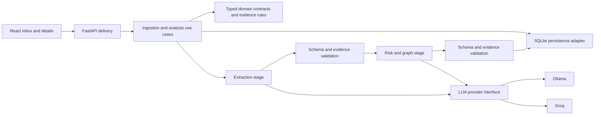

# Mail Risk Intelligence

A local full-stack email triage tool for the fictional Arcline compliance team. It extracts facts, assesses risk through two chained LLM stages, and persists evidence-linked entities and relationships.

## Status

The mandatory application flow is implemented: ten seed emails, pasted text and file ingestion, responsive inbox/detail views, extraction/risk panels, entities/relationships, provider adapters, SQLite history, retries, and tests. An aggregate graph API exists; an interactive graph UI is not implemented.

**The current model is not reliable enough for unattended triage.** A real ten-email `llama3.2:3b` baseline completed five runs; only two completed risk levels matched the accepted ranges. Codex review found unsupported claims and entity/relationship errors; independent human review remains pending. See [the evaluation report](evaluations/LLAMA_BASELINE_2026-10-06.md). A subsequent [Groq GPT-OSS comparison](evaluations/GROQ_BASELINE_2026-10-06.md) completed 9/10 cases with external quota pacing and matched accepted risk in 7/9 completed cases; semantic gaps remain. Provider failures remain visible and are never treated as risk `none`.

A [prompt-only v2 experiment](evaluations/PROMPT_EXPERIMENT_V2_2026-10-06.md) regressed completion from 5/10 to 2/10. Its prompts are archived for reproduction; default prompts remain the baseline version.

## Quick start

Requirements: Python 3.11+, [uv](https://docs.astral.sh/uv/), Node.js 22.12+ and npm. Dependencies are locked in `backend/uv.lock` and `frontend/package-lock.json`.

Start the backend in one terminal, from the repository root:

```sh
cd backend
uv sync --locked
test -f .env || cp .env.example .env
uv run uvicorn mailrisk.api:app --host 127.0.0.1 --port 8000
```

Start the UI in a second terminal:

```sh
cd frontend
npm ci
npm run dev
```

Open the URL printed by Vite (normally `http://127.0.0.1:5173`). The Vite development proxy forwards `/api` to backend port 8000. FastAPI API documentation is at `http://127.0.0.1:8000/docs`.

Use **one backend process**; do not run multiple Uvicorn workers. The in-process queue and startup interruption handling assume a single owner. Setup, installation from lockfiles, server startup, build, and tests were exercised locally. Sandbox restrictions in Codex required approval for dependency downloads and localhost binding; ordinary terminal operation does not require those tool overrides.

Ten seed records are imported and submitted only when absent. Restarting does not duplicate them or automatically resubmit failures. After configuring a provider, use each email's retry action. New emails follow the same normalization and analysis pipeline.

### Ollama (default)

Install Ollama using its [official instructions](https://docs.ollama.com/quickstart), start its service, and download a model separately:

```sh
ollama serve
# In another terminal:
ollama pull llama3.2:3b
```

The default configuration uses `OLLAMA_BASE_URL=http://localhost:11434` and `OLLAMA_MODEL=llama3.2:3b`. This is a starting candidate, **not a quality-validated model choice**. Local download and a short JSON-schema inference smoke test passed; the first seed baseline exposed reliability and semantic failures (see the evaluation report). Set another installed model in `.env` if appropriate, restart the backend, and evaluate before trusting results. Hardware affects latency; adjust the timeout if needed.

### Groq alternative

Set these values in `backend/.env`, then restart the backend:

```dotenv
LLM_PROVIDER=groq
GROQ_API_KEY=your-key-here
GROQ_MODEL=openai/gpt-oss-120b
```

The sample configuration still names `llama-3.3-70b-versatile`, which was unavailable to the tested key; explicitly select an accessible model such as the tested GPT-OSS candidate above. The free-tier experiment needed external pacing and still hit one quota error; the app does not yet implement token-budget scheduling.

Use an eligible free-tier account; check current access, model availability, and limits in the [Groq console](https://console.groq.com/docs/models). No paid key is required by the application. Groq processes email content externally; switching is explicit and never automatic. Missing selected-provider credentials/model or invalid prompt files produce a startup configuration error. An unreachable configured provider leaves the API operational and produces analysis errors.

Ollama uses its native JSON-schema output format. Groq uses JSON object mode with the schema included in instructions; the shared pipeline validates the result itself. JSON syntax is not a guarantee of schema compliance or factual correctness. See [Ollama API documentation](https://github.com/ollama/ollama/blob/main/docs/api.md) and [Groq structured outputs](https://console.groq.com/docs/structured-outputs).

## Configuration and prompts

See [backend/.env.example](backend/.env.example). Environment variables override `backend/.env`. Relative database and prompt paths resolve against `backend/`, independently of the working directory.

| Setting | Default / behavior |
| --- | --- |
| `LLM_PROVIDER` | `ollama`; alternatives: `groq` |
| `LLM_TIMEOUT_SECONDS` | 60 seconds per call, including an outer timeout |
| `LLM_MAX_RETRIES` | 1 additional call per stage maximum; 0 disables retries |
| `AGENT_A_SYSTEM_PROMPT_PATH` | `prompts/extraction_system.txt` |
| `AGENT_B_SYSTEM_PROMPT_PATH` | `prompts/risk_graph_system.txt` |
| `DATABASE_PATH` | `data/mail_risk.sqlite3` |
| `CORS_ORIGINS` | localhost/127.0.0.1 frontend origins on 5173 |

System prompts are version-controlled files, not multiline environment values. Each run snapshots them and records SHA-256 hashes, provider/model, schema/policy versions, stage attempts, latency, and available usage. Prompt snapshots are persisted locally but excluded from HTTP responses and routine logs. `.env`, runtime data, and private evaluation reports are ignored by Git.

## Architecture and domain boundaries



A modular monolith separates Mailbox inputs, Analysis lifecycle, and Knowledge Graph projections. Agent A/B are stages within Analysis, not independent services. Domain contracts do not depend on FastAPI, provider SDKs, or SQLite. Small ports enable provider substitution and deterministic failure tests.

SQLite uses relational tables for messages, runs, entities, mentions, and relationships. Normalized source segments, extraction, risk, and provenance are JSON payloads within message/run records. This keeps the local schema small; SQL-queryable fact tables and explicit schema migrations would be appropriate as querying needs grow.

Evidence stores a source ID and exact quote, validated against persisted normalized text. Entities and relationships retain evidence. Evidence presence does not establish that a quoted claim or an inferred relationship is true. Identity claims and allegations must remain qualified. Only complete email-shaped identifiers merge across runs; names and partial accounts remain separate.

A message can have several analysis runs. One successful run is selected for its current assessment and graph contribution. A failed newer run preserves the selected result and any completed extraction from the failed run. The UI displays selected extraction alongside selected risk when a previous success exists, avoiding mixed provenance. Detailed run history is persisted, but there is no dedicated history browser yet.

Graph data is persisted in SQLite; `/graph` aggregates only selected successful runs, retaining relationship message/run provenance. Interactive layout/pan/zoom would be browser state. No graph database is used.

## Failure handling and scope

- One active analysis, up to 20 pending runs, persisted processing states. Duplicate active submissions for a message reuse its run ID.
- Restart marks unfinished runs `interrupted`; manual retry creates a new run. Retry currently reruns both stages; partial extraction remains in history.
- Transient timeout/unavailable/rate-limit errors receive at most one retry; numeric Retry-After is capped at five seconds. Invalid output may use that same budget for repair. Authentication/configuration errors do not retry.
- Valid Agent A output is saved before Agent B. Failed processing never receives a `none` risk assessment.
- Queue saturation returns the persisted message ID; the UI opens it and retains the submission error so retry does not create another email.
- Inputs: UTF-8 `.txt`, MIME `.eml` with plain-text or HTML bodies and supported text/PDF attachments, and unencrypted text-layer `.pdf`. HTML is converted to inert text with link targets retained; script/style/head content is omitted. Image-only/encrypted PDFs are rejected. Unsupported attachments generate a visible note. No OCR.
- Upload limit: 10 MiB; normalized text limit: 100,000 characters. No silent truncation. PDF parser work is synchronous and not isolated into a resource-limited worker yet.
- Email content is displayed as text; links are not activated and source instructions are not executed. Prompt separation and validation reduce injection risk without guaranteeing model safety.

No auth, multi-tenancy, automated compliance decisions, durable distributed queue, cross-email risk reasoning, or production deployment is included. The product supports analyst triage, not verdicts. The UI uses CSS Modules, system fonts, semantic controls, native dialog focus handling, focus outlines, and textual risk labels. Mobile uses inbox/detail navigation.

## API

| Endpoint | Purpose |
| --- | --- |
| `GET /health` | Process/configuration status; does not prove model readiness |
| `GET /emails` | Inbox summaries with processing status and selected successful risk |
| `GET /emails/{id}` | Original sources, warnings, latest/selected runs, extraction, risk, entities, relationships |
| `POST /emails` | JSON `{ "raw_text": "..." }`; persist and enqueue |
| `POST /emails/upload` | Multipart field `file`; persist and enqueue |
| `POST /emails/{id}/analyses` | Submit analysis/retry |
| `GET /analyses/{id}` | State, safe error, partial/final results, provenance |
| `GET /graph` | Aggregate entities and relationships |

Accepted submissions return `202` with `message_id` and `analysis_run_id`. Invalid input returns 422, oversized uploads 413, unknown IDs 404, and queue saturation 429. Safe application errors use `error: {code, message, retryable}`; FastAPI validation errors use its standard `detail` format. The UI polls active work every two seconds.

## Verification and AI evaluation

Backend, from `backend/`:

```sh
uv run pytest -q
uv run ruff check .
uv run ruff format --check .
```

Frontend, from `frontend/`:

```sh
npm test
npm run build
npm run format:check
```

Verification result: **20 backend tests and six frontend tests passed**, with successful type checking/build and formatting checks. One upstream Starlette TestClient deprecation warning remains.

The deterministic suite covers ingestion and valid text PDF/EML attachments, queue behavior, restart/idempotency, bounded retries/timeouts, partial results, provider mappings/errors, selected graph contribution, and UI ingestion/error handling. Browser smoke checks covered desktop/mobile, paste and TXT upload, original text, and unavailable-provider retry. Successful model output is covered with explicit test doubles, not fabricated application data.

See [evaluation protocol and collector](evaluations/README.md). A one-case collector run against the actual unavailable Ollama configuration correctly recorded failure; no semantic accuracy score was produced. Groq has not been called. Use real inference after provider setup, then manually review facts, risk signals, evidence, and unsupported claims. The ten seed emails are a small regression set, not general accuracy evidence.

## Observability, trade-offs, and further work

Structured analysis logs include message/run IDs, stage, attempt, outcome, provider/model, timings, and safe errors. Successful stage logs include prompt hashes; run metadata retains prompt provenance. Bodies, attachments, full prompts, and provider error payloads are not logged. Operational reliability and semantic AI quality are measured separately.

| Decision | Benefit | Limitation |
| --- | --- | --- |
| Modular monolith | Clear internal boundaries and simple local operation | Shared deployment |
| SQLite + JSON value objects | Persistent setup without infrastructure provisioning | Limited write scaling and JSON querying |
| Explicit sequential stages | Inspectable extraction and failures | Latency and propagated extraction mistakes |
| Ollama default | Local operation without API keys | Hardware/download requirements and unvalidated candidate model |
| In-process queue | Small operational surface | Single process, no durable execution |
| Conservative entity matching | Avoids unsupported identity merges | Duplicate entities may remain |

With more time: introduce durable jobs with restart-safe claims/idempotency; adopt PostgreSQL when deployment/contention justifies it; manage inference capacity independently of worker count; add filtered graph queries and interactive graph UI; expand held-out evaluation and model comparison; add analyst corrections/audit/history; implement external-access auth, isolation, and retention. Add queue/stage percentiles, error rates, tracing, and actionable alerts as operational needs emerge. OCR and cross-email investigations follow explicit product requirements. Microservices and graph databases require measured resource, ownership, or query justification.

## Process and time

[PROCESS.md](PROCESS.md) records real Codex delegation, corrections, checks, limitations, and elapsed session time. The 5–6 hour assignment budget is a planning target, not a claimed human effort measurement. Significant completed blocks are committed locally; no remote or publication is configured.

[Original assignment](candidate_task_brief.md) · [Implementation baseline](docs/IMPLEMENTATION_PLAN.md) · [Agent instructions](AGENTS.md)
