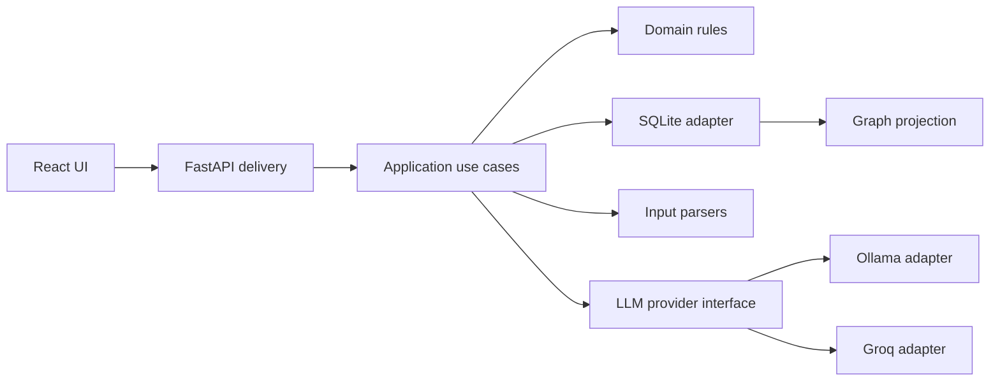

# Mail Risk Intelligence — Implementation Plan

## Status and success criteria

This is the approved implementation baseline, not a verification report. The mandatory application flow has now been implemented; see [README](../README.md) and [PROCESS](../PROCESS.md) for actual behavior and checks. Real provider experiments are documented in evaluations; semantic reliability remains insufficient for unattended triage. The primary target is the full-stack/pipeline track while meeting the mandatory UI requirements. The target implementation budget is 5–6 focused hours; record actual time honestly and account for documentation preparation separately.

The mandatory outcome is a locally runnable application with ten seed emails, text/file ingestion, two real chained LLM stages, persisted results, a responsive inbox/detail UI, explicit failures, tests, and verified setup documentation. No paid API key is required: Ollama is the default. An interactive aggregate graph is a bonus after the mandatory flow works.

## Architecture and ownership

Use a modular monolith with one FastAPI backend and a React/TypeScript/Vite frontend. Manage Python with uv and frontend dependencies with npm. Use CSS Modules for scoped styling without an additional styling framework. Use SQLite for local persistence.



Dependencies point inward. Domain rules have no FastAPI, provider SDK, or database imports. Application services own orchestration and transactions through small interfaces. Infrastructure implements persistence, parsing, prompt loading, and model access. FastAPI translates HTTP requests into use cases; React presents their results. Do not build a generic repository framework, event sourcing system, or distributed architecture.

### Lightweight domain-driven design

| Module | Owns | Boundary |
| --- | --- | --- |
| Mailbox | Original messages, source metadata, normalized body and attachment text | Ingestion does not decide risk |
| Analysis | Runs, extracted facts, evidence, risk assessments, processing lifecycle | Agent A/B are stages here, not separate bounded contexts |
| Knowledge Graph | Canonical entities, mentions, sourced relationships, aggregate projection | Derived from selected successful analyses, not an independent source of truth |

Treat Message and AnalysisRun as separate lifecycle units. A message can have multiple runs. Retain history and an explicit selected successful run per message; a failed newer run does not replace it. Do not treat the whole mailbox graph as one aggregate.

Domain vocabulary: Message, Attachment, AnalysisRun, ExtractedFact, EvidenceReference, RiskAssessment, Entity, EntityMention, Relationship. ReviewDecision is future work.

Invariants:

- Agent B requires validated Agent A output, including evidence and source metadata rather than a summary alone.
- Processing state and risk level are separate; failed or unavailable never means `none`.
- Completion requires both validated stages and an atomic save of the final assessment and graph contribution.
- Facts and relationships reference their originating message, source segment, and analysis run.
- A quoted allegation or claimed identity is not independently verified truth.
- Failed reanalysis preserves earlier successful results and successful extraction from the current run.
- Seed import is idempotent by original seed ID. Repeated analysis does not duplicate the selected graph contribution.

### Persistence and graph projection

Plan tables for messages, attachments/source segments, analysis_runs, extractions, risk_assessments, entities, entity_mentions, and relationships. Keep timestamps, errors, provider/model, prompt hashes, schema/policy versions, and stage timings on runs. Preserve the original sender separately from model-extracted identity claims.

Store evidence as a source-segment ID plus an exact quote and optional character offsets; define offsets against persisted normalized text. Validate quote presence and references. These checks establish structural grounding, not semantic truth.

Agent B returns run-local entity IDs. The backend validates references, conservatively resolves entities, and maps local IDs to persistent IDs inside a transaction. Names or account suffixes alone must not merge identities. A known exact email identifier can support a match; do not equate it with authentication of its owner. Preserve amount currency and account completeness.

Graph queries use only selected successful runs. Keep each relationship's evidence separately even when the UI combines equivalent edges and displays a source count. Persist the graph in SQLite; layout coordinates, selection, pan/zoom, and rendered nodes are frontend state. No graph database is needed for the MVP.

## AI workflow and configuration

Use an explicit bounded workflow:

`normalized input → Agent A → validation → Agent B → validation → transactional persistence`

No agent framework, tool execution, autonomous exploration loop, RAG, or cross-email investigation is necessary. Agent B assesses one email with its attachment evidence. Aggregate graph visibility does not imply cross-email risk reasoning.

### Provider interface

Define `LLMProvider.generate_structured(instructions, input, output_schema, timeout)` as an asynchronous operation returning generated content and available metadata (provider, model, duration, token usage). Implement Ollama and Groq adapters; provider SDKs, credentials, request formats, and response envelopes stay inside them. Orchestration owns domain-schema validation and the retry budget. Within that budget, invalid output receives bounded repair context containing the previous output and specific schema/evidence/reference errors as untrusted data. Transient failures repeat the request without inventing validation feedback. Persist sanitized attempt metadata, not raw invalid output; keep benchmark expected answers out of runtime repair context. Disable hidden SDK retries where they would exceed that budget.

Use one configured provider for both stages. Default to Ollama; do not automatically send local content to Groq if local inference fails. Groq is an explicitly selected alternative with a user-supplied key; verify current free-tier availability and supported models during implementation. Select exact model identifiers through actual evaluation rather than claiming an untested model choice.

Planned `backend/.env.example`:

```dotenv
LLM_PROVIDER=ollama
LLM_TIMEOUT_SECONDS=180
LLM_MAX_RETRIES=1
OLLAMA_BASE_URL=http://localhost:11434
OLLAMA_MODEL=
GROQ_API_KEY=
GROQ_MODEL=
AGENT_A_SYSTEM_PROMPT_PATH=prompts/extraction_system.txt
AGENT_B_SYSTEM_PROMPT_PATH=prompts/risk_graph_system.txt
AGENT_REPAIR_SYSTEM_PROMPT_PATH=prompts/repair_system.txt
DATABASE_PATH=data/mail_risk.sqlite3
```

Load settings from `backend/.env`; environment variables take precedence. Resolve relative prompt/database paths against the backend directory regardless of current working directory. Missing required provider settings or unreadable prompts should produce actionable configuration errors. A configured but unreachable provider should leave the API available and fail analysis visibly. Never expose credentials in error messages.

Store prompts in version-controlled UTF-8 files. Capture their content/hash when submitting a run and use that immutable snapshot for both stages; retain the snapshot with the run for reproducibility, without logging full prompts. Record schema and risk-policy versions. Keep secrets out of prompts and source control.

### Prompts and schemas

Agent A returns sender, recipients, date, subject, summary, and sourced facts for amounts, dates, accounts, references, and attachments. Preserve unknown fields as unknown; do not invent missing account details or dates.

Agent B returns level (`none`, `low`, `medium`, `high`), rationale, tags, entities, relationships, and evidence references. Define explicit risk guidance in its versioned prompt: urgency alone is insufficient for high risk; preserve allegations as allegations; distinguish ordinary business correspondence from concerning combinations of signals.

Separate system instructions from untrusted email/attachment content. Require the model to ignore instructions embedded in source content. This reduces risk but is not a guarantee; test adversarial cases and validate outputs. Do not render source HTML or activate suspicious links automatically.

## Reliability and API behavior

Run analysis inside the backend process, with one concurrent run and persisted lifecycle state: `queued`, `extracting`, `assessing`, `completed`, `failed`, `interrupted`. Use a bounded pending queue; reject excess submissions with a visible retryable response rather than accumulating unlimited tasks. Set an initial cap of 20 pending runs. On startup, mark unfinished runs interrupted; do not claim durable execution or automatic recovery. Retry creates a new run and may reuse valid extraction only when its source, schema, and prompt metadata match.

Use a configurable 180-second per-call timeout (the initial 60-second setting was increased at the user's request) and at most one additional provider call per stage. Retry only transient timeout/unavailable/rate-limit errors, respecting a bounded Retry-After delay. An invalid response may consume the additional call as a schema-repair attempt. Authentication/configuration errors fail immediately. Do not stack independent repair and retry budgets. Preserve valid A output if B fails.

Normalize errors as configuration, authentication, rate_limit, timeout, unavailable, invalid_output, or invalid_input. Return safe error codes/messages and retryability. Mock results exist only in explicit tests.

| Endpoint | Contract |
| --- | --- |
| `GET /emails` | Inbox summaries with processing status and selected successful risk badge |
| `GET /emails/{id}` | Original sources, current/latest run, selected successful results, evidence, entities, relationships |
| `POST /emails` | JSON `{raw_text}`; persist input and submit analysis; return 202 with message/run IDs |
| `POST /emails/upload` | Multipart file; same normalized pipeline and 202 response |
| `POST /emails/{id}/analyses` | Submit a new analysis/retry; return 202 and run ID; avoid concurrent duplicate runs for one message |
| `GET /analyses/{id}` | State, stage, safe error, and result availability for polling |
| `GET /graph` | Optional aggregate nodes/edges with source references from selected successful runs |

Unknown IDs return 404, invalid input 422, oversized input 413, and queue saturation 429. Poll active runs approximately every two seconds and stop at terminal states. Ingestion persists a message even if analysis submission cannot be accepted; return its ID with the submission error so the UI does not create a duplicate on retry.

Seed import and user ingestion share normalization and analysis use cases. Import seed records only when absent; enqueue new seed records within queue limits. Do not call the model synchronously while booting the server.

Support pasted text, UTF-8 `.txt`, MIME-aware `.eml`, and text-layer `.pdf`. For `.eml`, normalize body and supported textual attachments; report skipped unsupported attachments. Seed attachments use supplied `extracted_text`. Reject encrypted/image-only PDFs with an actionable limitation message. Initial upload limit: 10 MiB; normalized text limit: 100,000 characters. Reject oversized content rather than silently truncating it. Store uploads as data, never execute them.

## UI and mandatory scope

Build inbox and selected-email detail views, ingestion form/file picker, original content, structured facts, risk rationale, and entity/relationship panel. Show processing, empty, loading, partial-success, provider-error, and retry states. Previous successful risk remains visible with a clear label when a new run fails.

Use text labels alongside color badges, semantic controls, keyboard access, visible focus, and readable contrast. Verify desktop and a 390px viewport with no horizontal page overflow. On narrow screens use inbox/detail navigation instead of compressing two columns.

The interactive aggregate graph is optional; the per-email entities/relationships panel is mandatory. Exclude auth, OCR, graph databases, microservices, production monitoring infrastructure, and cross-email investigations from MVP scope.

## Observability

Emit structured logs with message_id, analysis_run_id, stage, attempt, outcome, provider/model, prompt hash, duration_ms, and normalized error_code. Record token usage when provided. Do not log email bodies, attachments, credentials, full prompts, or raw provider payloads. Persist run metadata for debugging and evaluation provenance.

MVP observability is structured logs and persisted run metadata, not a deployed dashboard stack. Operational success does not establish AI quality. Future metrics: queue wait, A/B latency p50/p95, timeout/schema-error rates, retries, completion rates, and available token/cost data. Add tracing and actionable alerts when deployment warrants them.

## Implementation stages

Each stage starts with a PROCESS entry and ends with checks, an honest outcome, and a logical milestone commit. Time estimates are targets, not evidence of time spent.

| Stage | Budget | Actions and acceptance gate |
| --- | --- | --- |
| Foundation | 40 min | Create backend/frontend with uv/npm; contracts, settings, provider interface, SQLite schema; API starts and frontend builds; configuration errors are actionable |
| Ingestion/storage | 50 min | Common parsers and persistence; seed import twice still yields ten seed messages; all supported formats reach the same pipeline; invalid files fail safely |
| Providers/workflow | 90 min | Implement both adapters, prompts, validators, lifecycle, retries, run history, graph mapping; real Ollama execution succeeds and simulated failures preserve partial output |
| API/UI | 90 min | Implement HTTP contracts and integrated responsive inbox/detail/ingestion; complete user flow works on desktop/mobile; failure and retry states are visible |
| Verification/docs | 60 min | Relevant tests, actual seed evaluation, reproducible installation, verified README and updated PROCESS; report unresolved issues instead of hiding them |
| Reserve/bonus | 30 min | Fix mandatory gaps first; only then add interactive aggregate graph and verify its interactions |

Use `backend/pyproject.toml` and committed `uv.lock`; use `frontend/package.json` and committed `package-lock.json`. Install through `uv sync --locked` and `npm ci`. Execute Python tools through `uv run` and frontend tasks through npm scripts. Do not introduce parallel pip/requirements.txt, Poetry, yarn, or pnpm workflows. Choose dependencies from current primary documentation during implementation.

## Engineering tests and AI evaluation

### Engineering verification

Use pytest for backend behavior and Vitest/React Testing Library for meaningful frontend interactions. Test contracts and failures rather than mirroring internal implementation. Mock providers for deterministic tests; live inference is separate.

Cover normalization and file failures; repeated seed import; selected-provider configuration; provider request/response mapping; authentication/rate-limit/timeout errors; malformed JSON; bounded retries; B failure after A success; interrupted restart states; evidence/ref validation; conservative entity matching; selected-run projection without duplicates; and UI ingestion/retry/partial states. Run frontend type checking/build and inspect keyboard/mobile flows.

### AI quality evaluation

Create a manually reviewed evaluation specification with required facts, expected risk signals, acceptable level sets, prohibited unsupported claims, and evidence expectations. Do not compare rationale strings verbatim. Evaluate actual outputs and retain a compact results report with model/provider, settings, prompt hashes, schema/policy versions, runtime, and failures.

| Seed case | Minimum review focus |
| --- | --- |
| E001 | Claimed CEO identity, lookalike domain, urgency/secrecy, $184,500; no invented account |
| E002 | Routine maintenance; avoid urgency-based false positives |
| E003 | Confidential attachments and forwarding before resignation; capture attachment amounts |
| E004 | $47,300 invoice, changed account suffix, historical amounts; do not treat suffix as full account |
| E005 | Preannouncement share suggestion and deletion request; MNPI risk |
| E006 | Threat language grounded in source text |
| E007 | Routine holiday communication and attachment |
| E008 | Suspicious reset URL/domain and urgency; do not activate the link |
| E009 | Earlier ordinary invoice; distinguish from changed-payment signal |
| E010 | Anonymous accounting allegation; preserve allegation rather than assert proven misconduct |

Measure extraction completeness, unsupported facts, missed risk signals, false positives, sourced relationships, and embedded-instruction resistance. Review failures in A and B separately to identify propagation. The ten seed emails are smoke/regression coverage, not general accuracy evidence. Add small benign-urgency, ambiguity, and prompt-injection cases if time allows; expand them later.

Run actual Ollama evaluation on seed data. Run a Groq smoke test only when credentials are available and document whether it was executed. Never report mocked tests as proof of real provider availability or model quality.

## Assumptions, trade-offs, and further work

Assumptions: one trusted local analyst; no user accounts; analysis is triage, not a verdict; supplied seed attachment text is usable; no OCR; risk reasoning is per email. Unknown dates/identities remain unknown. Provider hardware, availability, and free-tier limits affect latency and capacity.

| Choice | Benefit | Limitation |
| --- | --- | --- |
| Modular monolith | Small operational surface and clear internal boundaries | Modules deploy together |
| SQLite | Simple persistent local setup | Limited multi-process write scaling |
| Two sequential calls | Inspectable extraction and assessment | Extra latency and extraction-error propagation |
| Local Ollama default | No API key required; local processing | Requires model download and sufficient hardware |
| In-process queue | Fits timebox | Interrupted work requires manual retry |
| Conservative matching | Avoids unsupported identity merges | May retain duplicate entities |
| SQL graph projection | Evidence-friendly and sufficient for small data | Complex large traversals may need a different store |

With more time, prioritize durable jobs with restart-safe claims/idempotency, then PostgreSQL when contention/deployment requires it, inference capacity/concurrency management, filtered graph/neighborhood queries, expanded held-out evaluation, analyst review with audit history, and external-access authentication/isolation/retention controls. Add observability in parallel as operational needs emerge. OCR and cross-email risk reasoning follow explicit product requirements. Split workers, parsing, or inference into services only when measured resource/isolation, ownership, or release needs justify it; adding workers alone does not remove an inference bottleneck.

## Delivery gate

Mandatory flow works with real inference; unhappy paths are visible; selected results and graph evidence survive restart; setup is verified from lockfiles; tests/evaluation outcomes and actual time are recorded. README distinguishes implemented behavior from future design, documents explicit provider switching, and discloses limits. PROCESS captures real AI use, corrections, and autonomy. Do not sacrifice mandatory requirements for graph polish.

## Approved risk-catalog extension

The user requested rollback to llama3.2:3b and an editable JSON context catalog, persisted in SQLite with a simple React editor. Agent A remains unchanged; Agent B receives the complete active catalog as advisory context. No vector retrieval or deterministic risk engine is introduced. Examples illustrate signals and never count as email evidence.

Bootstrap a new database from RISK_CONTEXT_PATH; validate structure, unique IDs, signal references and size. Persist immutable revisions and one active selection. GET/PUT /risk-context expose editing with expected_revision_id compare-and-save; stale writes return 409. New analyses snapshot version, revision ID and canonical hash; existing runs/results are unchanged. Validate restart persistence, duplicate-content idempotency, stale-save handling, stage isolation and immutable snapshots.

The current catalog remains experimental: the three-case Llama smoke completed two cases but matched no expected risk levels. Prioritize evidence-bearing observed signals, prevention of example/signal leakage, and an independently reviewed rubric before treating this as deterministic policy. Expanded catalogs may require selective retrieval and explicit token-budget handling; a 16 KB catalog cap and 8192-token Ollama context do not solve arbitrary long-document ingestion.
